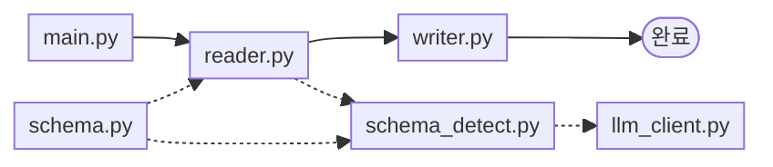
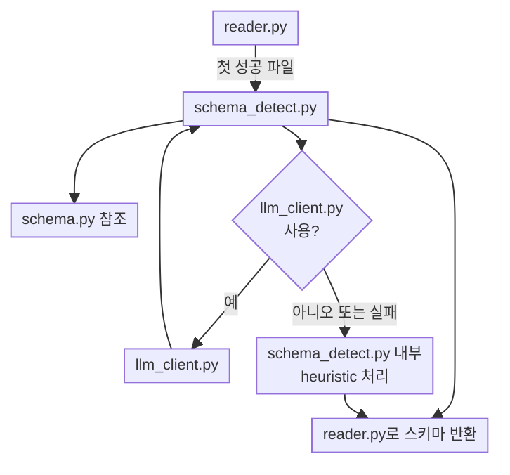

# Excel Budget

여러 개의 예실대비표 엑셀을 읽어 **원본 시트 N개 + 통합 시트 1개**로 정리하는 프로젝트입니다.

비용 코드를 기준으로 같은 항목을 맞춘 뒤, 금액 열을 셀별로 합산합니다.

---

## 결과 구성

| 입력 파일 수 | 결과 시트 |
|--------------|-----------|
| 2개 | 원본 2 + 통합 1 = **3개** |
| 10개 | 원본 10 + 통합 1 = **11개** |

예:

```text
data/input/
  03_트윈_예실대비표.xlsx
  04_분산_예실대비표.xlsx
```

↓

```text
data/output/예실대비표_통합결과.xlsx
  ├─ 트윈   (원본)
  ├─ 분산   (원본)
  └─ 통합   (비용 코드별 합산)
```

---

## 사용 방법

> **필요 조건:** Python 3.10 이상

```bash
cd excel-budget
python3 -m venv .venv
source .venv/bin/activate          # Windows: .venv\Scripts\activate
pip install -r requirements.txt
```

1. 통합할 엑셀 파일을 `data/input/`에 넣습니다.
2. 아래 명령을 실행합니다.

```bash
python src/main.py
```

3. `data/output/예실대비표_통합결과.xlsx`를 확인합니다.

### LLM 없이 실행 (규칙 기반만)

```bash
BUDGET_LLM_DISABLED=1 python src/main.py
```

### LLM으로 표 구조 자동 탐지 (기본)

Ollama가 `http://localhost:11434`에서 동작 중이어야 합니다.

```bash
# 기본 모델: qwen2.5:7b
python src/main.py
```

| 환경변수 | 기본값 | 설명 |
|----------|--------|------|
| `BUDGET_LLM_MODEL` | `qwen2.5:7b` | Ollama 모델명 |
| `BUDGET_LLM_BASE_URL` | `http://localhost:11434` | Ollama 주소 |
| `BUDGET_LLM_DISABLED` | (없음) | `1`이면 LLM 비활성 |

LLM 탐지가 실패하면 규칙 기반 추론으로 자동 전환됩니다.

---

## 코드 실행 흐름



**실선** = 실제 실행 순서 · **점선** = 필요할 때만 호출

1. `main.py` — 시작, 전체 조율
2. `reader.py` — 엑셀 읽기 · 비용 코드 통합
3. `writer.py` — 결과 xlsx 저장

> `schema_detect.py`는 **첫 번째 성공 파일**을 읽을 때만 호출됩니다.  
> `llm_client.py`는 LLM 사용 가능할 때만, `schema.py`는 스키마 정의 참조용입니다.


### 스키마 탐지 흐름 (`schema_detect.py` 진입 시)



---

## 통합 방식

1. `data/input/`의 모든 `.xlsx`를 읽습니다. (`~$` 임시 파일, 출력 파일은 제외)
2. 표 구조(열 위치, 소계·요약 규칙)를 LLM 또는 규칙으로 탐지합니다.
3. **비용 코드**로 항목을 맞춥니다. (행 번호가 달라도 동일 코드끼리 합산)
4. 한쪽 파일에만 있는 항목은 없는 쪽을 `0`으로 보고 합칩니다.
5. 원본 시트 N개와 통합 시트 1개를 저장합니다.

파일명에서 과제명을 추출합니다.

```text
03_트윈_예실대비표.xlsx  → 시트명: 트윈
04_분산_예실대비표.xlsx  → 시트명: 분산
```

---

## 프로젝트 구조

```text
excel-budget/
├─ data/
│  ├─ input/          # 입력 엑셀 (직접 추가)
│  └─ output/         # 통합 결과
├─ src/
│  ├─ main.py         # 실행 진입점
│  ├─ reader.py       # 파일 읽기·비용 코드 합산
│  ├─ writer.py       # 결과 엑셀 작성
│  ├─ schema.py       # 표 구조 스키마
│  ├─ schema_detect.py# LLM/규칙 기반 구조 탐지
│  └─ llm_client.py   # Ollama 호출
├─ requirements.txt
└─ .gitignore
```

> `data/input/`, `data/output/`의 엑셀은 `.gitignore`로 제외되어 있습니다.  
> 폴더 자체는 `.gitkeep`으로 유지됩니다.

---

## 의존 패키지

- `openpyxl` — 엑셀 읽기/쓰기
- `requests` — Ollama API 호출
